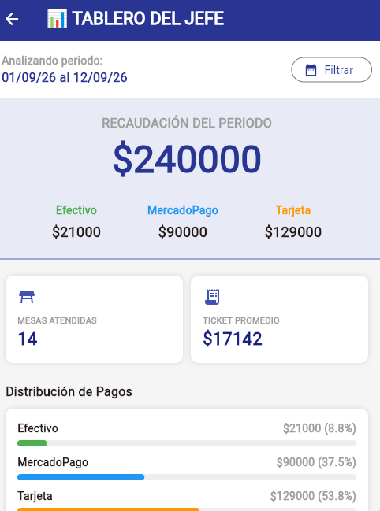
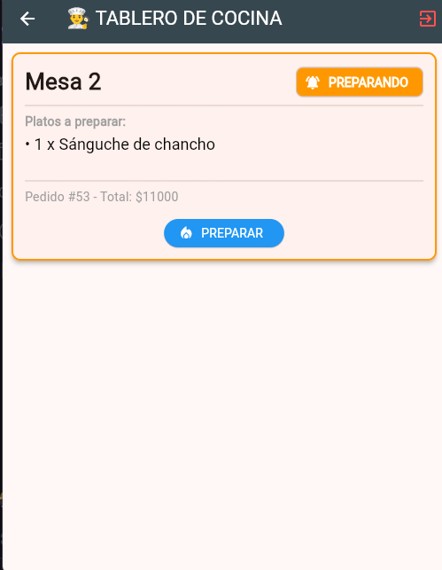
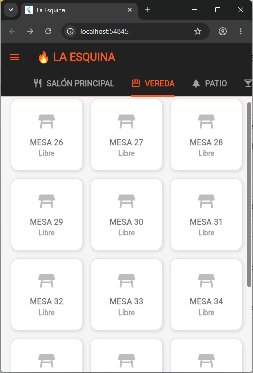
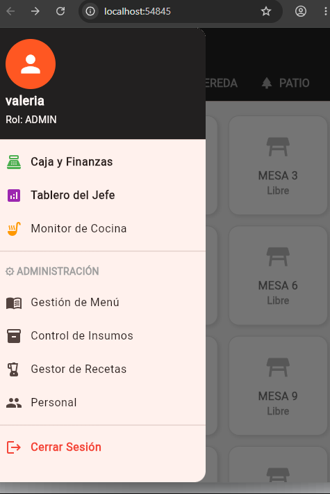

# 🍔 La Esquina - Sistema de Gestión Gastronómica en Tiempo Real!

https://drive.google.com/file/d/1Uhf_45d-Je80Y-V33fHok2YnFDlgATme/view?usp=sharing

> Un ecosistema Full-Stack y Mobile diseñado para erradicar las pérdidas de inventario, optimizar la comunicación en cocina y proveer métricas financieras en tiempo real para el sector gastronómico.

## 🚀 Mi Rol y Stack Tecnológico

*   **Rol:** Full-Stack & Mobile Developer
*   **Frontend Mobile:** Flutter, Dart (Android APK)
*   **Backend & Base de Datos:** Supabase (PostgreSQL)
*   **Despliegue Web (Dashboard):** Vercel
*   **Autenticación:** RBAC (Role-Based Access Control) con PIN

## 💡 El Desafío de Negocio

Los comercios gastronómicos sufren pérdidas constantes por tres cuellos de botella:
1. Descontrol de insumos en cocina.
2. Demoras en el flujo de comandas entre mozos y cocina.
3. Falta de métricas consolidadas sobre cobros y cajas diarias.

## 🛠️ Solución Técnica y Arquitectura

Para resolver estos problemas, diseñé e implementé los siguientes módulos core:

*   📦 **Motor de Inventario de Gramaje (Recetario Dinámico):** Lógica algorítmica que calcula y descuenta insumos a nivel ingrediente (ej. gramos de carne o lechuga por hamburguesa vendida) en el momento exacto en que se toma la comanda.
*   🔔 **Monitor de Cocina y WebSockets:** Flujo bidireccional en tiempo real. Cambio de estados ("En preparación" ➔ "Listo") con alertas instantáneas al mozo indicando el número de mesa.
*   🔐 **Control de Acceso (RBAC):** Autenticación rápida mediante PIN para el personal (Cocina, Mozo, Administrador), adaptando la interfaz dinámicamente según los permisos.
*   🗺️ **Layout Interactivo de Salón:** Distribución visual por sectores (Salón, Vereda, Patio). Estado visual dinámico de mesas (Libre vs. Ocupada) e integración de pago directo por QR, eliminando la dependencia de terminales POS físicas.
*   📊 **Dashboard Financiero & BI:** Arqueo e historial de caja. Métricas en vivo de ticket promedio, recaudación por medio de pago (tarjeta, efectivo, QR) y ranking estadístico de platos.

## 📱 Demostración Visual
## 📱 Demostración Visual








## ⚙️ Instalación y Pruebas Locales

1. Clonar el repositorio:
   ```bash
   git clone [https://github.com/Kelany29/la-esquina-app.git](https://github.com/Kelany29/la-esquina-app.git)